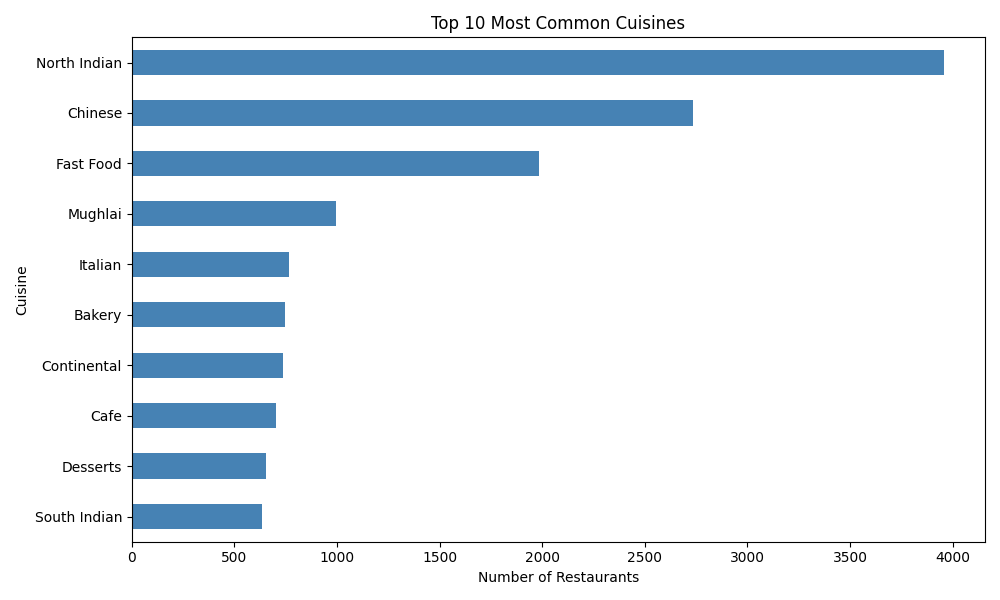

# Restaurant Recommendation System

Content-based recommendation engine that suggests similar restaurants based on cuisine preferences, pricing, and location.

## Download

[](https://github.com/dipayansamanta172-lgtm/Restaurant-Recommendation-System-using-Machine-Learning/archive/refs/heads/main.zip)
[](https://github.com/dipayansamanta172-lgtm/Restaurant-Recommendation-System-using-Machine-Learning/raw/main/Dataset.csv)

## Overview

This project builds a recommendation system that analyzes 9,551 restaurants across 141 cities and suggests similar establishments based on shared characteristics. Using content-based filtering, the system compares restaurants by cuisine type, location, price range, and ratings to generate personalized recommendations.

The system uses feature vectorization and similarity scoring to match restaurants with comparable attributes, helping users discover new dining options that align with their preferences.

## Features

- Content-based restaurant recommendation engine
- Automatic data preprocessing and validation
- Cuisine, location, and price range analysis
- Similarity scoring and ranking
- Multi-dimensional feature comparison
- Recommendation quality metrics
- Visual cuisine distribution analysis

## Technologies Used

- Python 3
- Pandas (data manipulation)
- NumPy (numerical computing)
- Scikit-Learn (feature vectorization and similarity)
- Matplotlib (visualization)

## Dataset

**Dataset.csv** contains 9,551 restaurant records from 141 cities.

**Key Features:**
- Cuisines offered (146 unique cuisine types)
- Price range (1-4 scale)
- Aggregate rating (0.0 - 4.9 scale)
- City location
- Online delivery availability
- Table booking availability

## Repository Structure

```
.
├── task2.py                        # Recommendation system script
├── Dataset.csv                     # Restaurant data
├── output.txt                      # Detailed analysis and recommendations
├── recommendation_analysis_graph.png # Cuisine distribution chart
└── README.md
```

## How It Works

1. **Data Preprocessing** - Cleans restaurant data and handles missing values
2. **Feature Engineering** - Extracts cuisine, city, price, and service attributes
3. **Vectorization** - Converts text features using TF-IDF and normalizes numeric values
4. **Similarity Calculation** - Computes cosine similarity between all restaurant pairs
5. **Recommendation Generation** - Ranks and returns top 5 similar restaurants for each input
6. **Quality Analysis** - Evaluates recommendation consistency across shared attributes

## Sample Output Graph



## Running the Project

**Windows:**
```bash
python task2.py
```

**Linux/macOS:**
```bash
python3 task2.py
```

Output files generate automatically in the same directory.

## Installation

### Prerequisites

[](https://www.python.org/downloads/)
[](https://code.visualstudio.com/)

### Install Required Libraries

**Windows:**
```bash
pip install pandas
pip install numpy
pip install matplotlib
pip install scikit-learn
```

**Linux/macOS:**
```bash
pip3 install pandas
pip3 install numpy
pip3 install matplotlib
pip3 install scikit-learn
```

## Output Files

**output.txt** - Complete analysis report containing:
- Dataset overview and preprocessing metrics
- Cuisine distribution and ratings analysis
- City-level restaurant patterns
- Price range breakdown
- Recommendation examples with similarity scores
- Quality metrics for recommendation accuracy

**recommendation_analysis_graph.png** - Horizontal bar chart showing the top 10 most common cuisines

## Recommendations Generated

- **Average similarity score:** 0.9422 across all recommendations
- **Highest scoring match:** 1.0000 (perfect similarity)
- **Coverage:** 100% of sample restaurants received 5+ recommendations

**Sample recommendations include:**
- Le Petit Souffle → Similar French and fine-dining restaurants
- RR China Tawun → Similar Chinese restaurants with matching price range
- Chilli Tadka → Similar North Indian budget establishments
- Walter's Coffee Roastery → Similar cafes and dessert venues

## Key Findings

- North Indian (3,960), Chinese (2,735), and Fast Food (1,986) are the most common cuisines
- 25.66% of restaurants offer online delivery
- 12.12% of restaurants offer table booking
- Restaurants with online delivery average 3.25 rating vs 2.47 without
- Restaurants with table booking average 3.44 rating vs 2.56 without
- Price range 4 restaurants average 3.82 rating vs 2.00 for price range 1

## Future Improvements

- Add collaborative filtering for user-based recommendations
- Implement hybrid recommendation combining content and user behavior
- Build REST API for real-time restaurant suggestions
- Add user preference learning from interaction history
- Integrate geolocation-based nearby restaurant discovery

---

**Dataset Source:** Restaurant data from major Indian cities  
**Author:** Dipayan Samanta  
**License:** Open source
